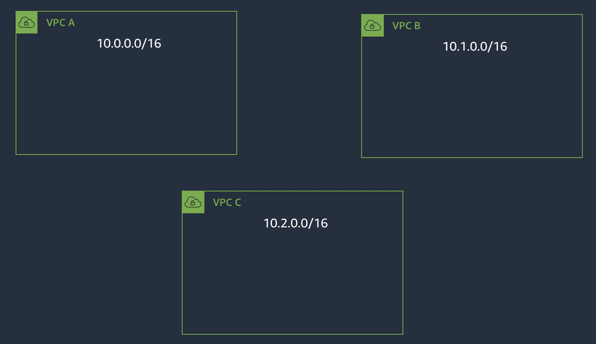
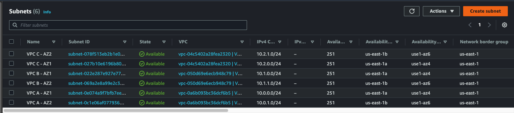
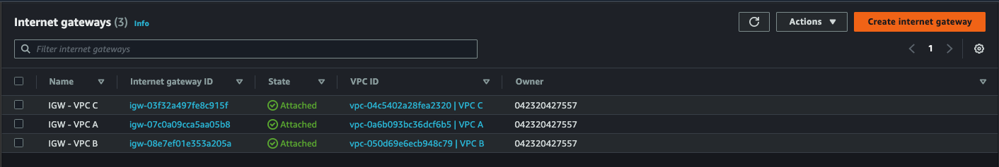
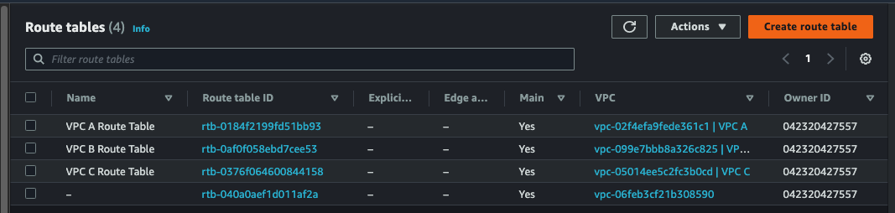

## Lab 1: Multi-VPC Account Architecture

"Every action you take is a vote for the person you wish to become."

### Lab 1.1: Create VPCs, Subnets, and EC2 Instances
#### Use Case
Create three VPCs with private subnets. Each VPC will have subnets in two Availability Zones (AZs) within the Region.
You will deploy one EC2 instance per VPC and demonstrate that, by default, VPCs provide network isolation.

| VPC Name | VPC CIDR block | Availability Zone | Availability Zone CIDR block |
| :-------- | :-------- | :-------- | :-------- |
| VPC A | 10.0.0.0/16 | us-west-1a | 10.0.0.0/24 |
| | | us-west-1b | 10.0.1.0/24 |
| VPC B | 10.1.0.0/16 | us-west-1a | 10.1.0.0/24 |
| | | us-west-1b | 10.1.1.0/24 |
| VPC C | 10.2.0.0/16 | us-west-1a | 10.2.0.0/24 |
| | | us-west-1b | 10.2.1.0/24 |

*Table 1. IPv4 CIDR allocations for VPCs and AZs*

### Step 1.1a: Create VPCs
#### Procedure
Create 3 VPCs with non-overlapping CIDR blocks.
* Navigate to VPC Dashboard Services
* Navigate to "Your VPCs" tab and click "Create VPCs" button to create 3 VPCs. Use **VPC only option** and assign the specified IPv4 CIDR in the table.

  

### Step 1.2a: Create Subnets
For each VPC, you will create two subnets - one per availability zone.
* Navigate to **Subnets** panel
* Create subnets with names that reflect VPC and AZ placement, such as **VPC A - AZ1**, select **AZ** and provide subnet **CIDR**:
* **Click** on **Add new subnet** to add one more subnet into AZ2 with name like VPC A - AZ2:
* **Repeat the steps above** to create subnets for **VPC B** and **VPC C**; refer to Table 1 for CIDR allocations.
* Verify that **six subnets** are created and available.

  

##### Step 1.3a: Deploy Internet Gateways
* Navigate to Internet Gateways and click on "**Create internet gateway**".
* Give it a name such as **VPC A - IGW**. Click "Create internet gateway".
* Select newly created **IGW** and click on "**Attach to VPC**":
* Attach this **IGW** to "**VPC A**":
* **Repeat these steps** to create **and attach IGWs in "VPC B" and "VPC C"**. You should now have an **IGW for the default VPC** and **three** newly created IGWs available:

##### Step 1.4a: Updating Routing Tables
In order to utilize newly created **Internet Gateways**, you need to update VPC routing tables to point the default routes to these IGWs.
* In VPC Dashboard, navigate to **Route Tables**
* Assign names to the Route Tables by identifying what VPC a given Route Table belongs to:
* **Navigate to "VPC A Route Table** and **click** on **"Routes"** tab. **Click** on **"Edit Routes:"**
* **Modify Route Table** to add the default route 0.0.0.0/0 **pointing to the Internet Gateway**.
* **Repeat** these steps **for "VPC B" and "VPC C"** route tables.

#### VPC	EC2 instance Private IP Address
* VPC A	10.0.0.27
* VPC B	10.1.1.97
* VPC C	10.2.0.144
